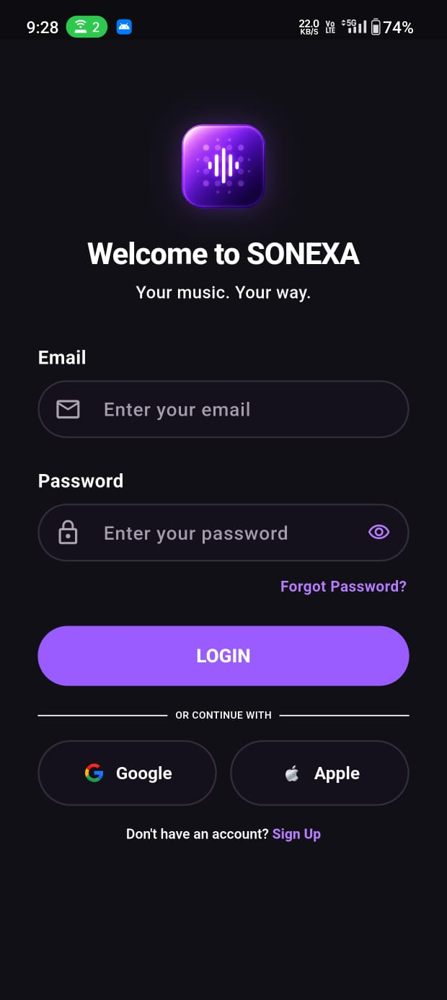
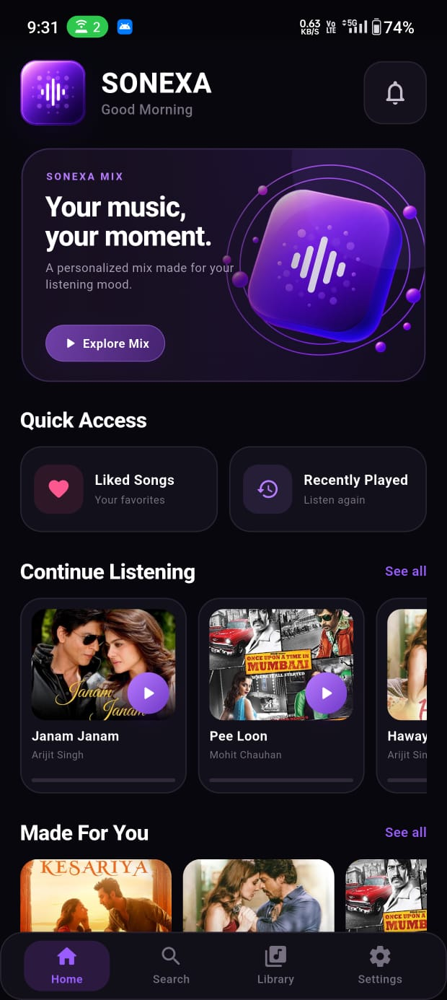
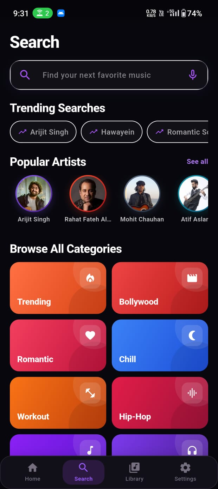
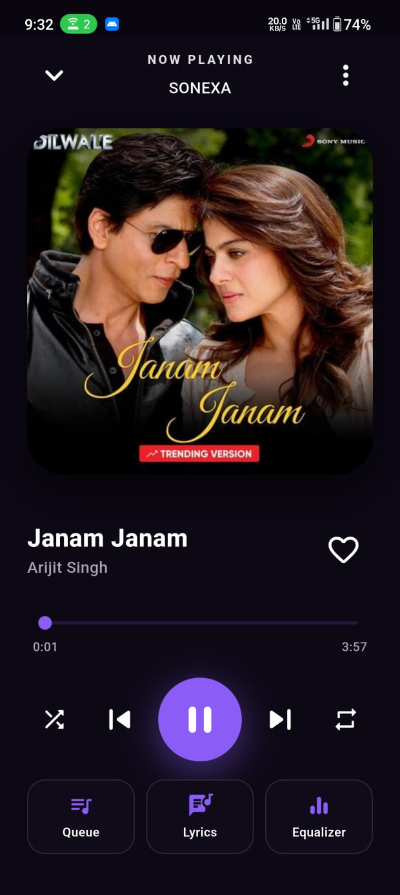
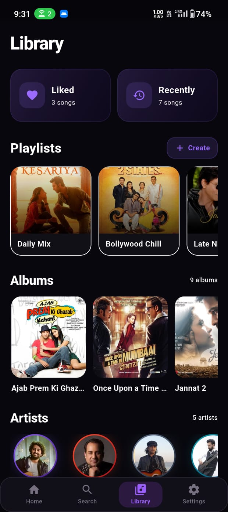
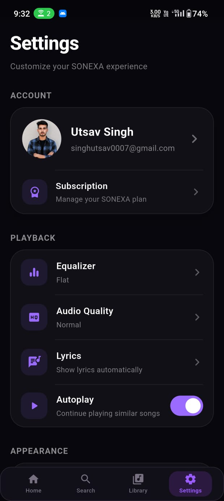

<div align="center">

# 🎵 SONEXA

### Your Music. Your Mood.

**A modern Flutter music player with a premium dark interface and an intuitive listening experience.**

Built with Flutter & Dart 💜

</div>

---

## 🎧 About SONEXA

**SONEXA** is a modern music player application developed using **Flutter and Dart**.

The project focuses on delivering a clean and engaging music experience through a premium dark-themed interface, smooth navigation, music playback controls, playlists, favorites, search, queue management, lyrics, equalizer controls, and an organized music library.

SONEXA was created as a personal portfolio project to demonstrate Flutter application development, UI/UX design, audio playback integration, state handling, reusable components, and local data persistence.

---

## 📱 App Preview

<p align="center">
  
  
  
</p>

<p align="center">
  
  
  
</p>

---

## ✨ Features

### 🎵 Music Playback

- Play and pause music
- Previous and next track controls
- Seek through the currently playing track
- Playback progress display
- Shuffle and repeat controls
- Persistent mini player
- Full Now Playing experience

### ❤️ Personal Music

- Liked Songs / Favorites
- Recently Played
- Continue Listening
- Music playlists
- Albums
- Artists
- All Songs

### 🏠 Music Discovery

SONEXA's Home experience includes sections such as:

- Quick Access
- Continue Listening
- Made For You
- Trending Now
- Popular Playlists
- Mood & Vibes
- Recommended For You

### 🔍 Search

- Dedicated music search interface
- Song discovery
- Artist discovery
- Browse music categories
- Recent search experience

### 🎶 Player Experience

- Modern Now Playing screen
- Album artwork
- Music queue
- Lyrics screen
- Equalizer controls
- Favorite / Like controls
- Shuffle and repeat
- Seek controls

### 📚 Music Library

Organize and access music through:

- Liked Songs
- Recently Played
- Playlists
- Albums
- Artists
- All Songs

### ⚙️ Additional Screens

SONEXA also includes interfaces for:

- Notifications
- Settings
- Account Settings
- Connected Devices
- Audio Quality
- Appearance
- Language
- Security
- Help & Support
- Feedback
- About SONEXA
- Logout

---

## 🎨 UI / UX

SONEXA uses a consistent modern visual identity across the application.

### Design Highlights

- 🌑 Premium dark interface
- 💜 Purple accent color system
- 🎴 Rounded cards and containers
- 🎵 Music-focused visual hierarchy
- 📱 Mobile-first responsive layouts
- 🧭 Consistent bottom navigation
- 🎧 Persistent mini-player experience
- ✨ Modern music-player inspired interface

---

## 📱 Main Screens

| Screen | Purpose |
|---|---|
| Login | User entry experience |
| Home | Music discovery and quick access |
| Search | Search and browse music |
| Now Playing | Complete playback controls |
| Queue | Manage upcoming music |
| Lyrics | View song lyrics |
| Equalizer | Audio customization controls |
| Library | Access personal music collection |
| Liked Songs | Favorite music collection |
| Recently Played | Previously played tracks |
| Playlists | Playlist collection |
| Albums | Album collection |
| Artists | Browse music by artist |
| All Songs | Complete song collection |
| Notifications | Notification interface |
| Settings | Application preferences |
| Account Settings | Account-related options |
| Connected Devices | Device management interface |
| Help & Support | Support information |
| Feedback | Feedback interface |
| About | SONEXA application information |

---

## 🛠️ Tech Stack

| Technology | Usage |
|---|---|
| Flutter | Cross-platform application development |
| Dart | Application programming language |
| just_audio | Audio playback |
| SharedPreferences | Local preferences and data persistence |
| Material Design | UI components and application design |

---

## 🏗️ Project Structure

```text
SONEXA/
│
├── android/
├── assets/
├── ios/
├── lib/
│   ├── data/
│   ├── models/
│   ├── navigation/
│   ├── player/
│   ├── screens/
│   ├── services/
│   ├── theme/
│   ├── widgets/
│   └── main.dart
│
├── screenshots/
│   ├── 01_login.png
│   ├── 02_home.png
│   ├── 03_search.png
│   ├── 04_now_playing.png
│   ├── 05_library.png
│   └── 06_settings.png
│
├── pubspec.yaml
└── README.md
```

---

## 🚀 Getting Started

### Prerequisites

Before running SONEXA, make sure you have:

- Flutter SDK
- Dart SDK
- Android SDK
- Android Studio or Visual Studio Code
- Android device or emulator

Check your Flutter installation:

```bash
flutter doctor
```

### 1. Clone the Repository

```bash
git clone https://github.com/utsavsingh1920/SONEXA.git
```

### 2. Open the Project

```bash
cd SONEXA
```

### 3. Install Dependencies

```bash
flutter pub get
```

### 4. Run SONEXA

Connect an Android device or start an emulator and run:

```bash
flutter run
```

---

## 🎯 Project Goals

SONEXA was developed to practice and demonstrate:

- Flutter mobile application development
- Dart programming
- Modern mobile UI/UX design
- Audio playback integration
- Application state handling
- Local data persistence
- Multi-screen Flutter architecture
- Reusable widgets and components
- Navigation between application screens
- Building a complete portfolio-level mobile application

---

## 🔮 Future Improvements

SONEXA is an evolving project. Possible future improvements include:

- Dynamic local-device music library
- Improved background audio playback
- Media notification controls
- Lock-screen playback controls
- Bluetooth/headset media controls
- Enhanced album artwork support
- Improved music discovery
- Additional playback customization
- Further performance and architecture improvements

---

## ⚠️ Project Status

SONEXA is currently a **personal educational and portfolio project**.

The current version demonstrates the application's music-player experience and core UI/functionality. Some advanced integrations shown in the interface may be expanded in future versions.

---

## 👨‍💻 Developer

**Utsav Singh**

B.Sc. Information Technology Graduate  
Flutter & Full-Stack Development Enthusiast

---

## 📄 Disclaimer

SONEXA is an educational and portfolio project.

Any music, artist names, album artwork, trademarks, or other third-party media used for demonstration purposes remain the property of their respective owners.

SONEXA is not affiliated with or endorsed by any music streaming platform or record label.

---

<div align="center">

### 🎵 SONEXA

**Your Music. Your Mood.**

Made with 💜 using Flutter

© 2026 Utsav Singh. All Rights Reserved.

</div>
