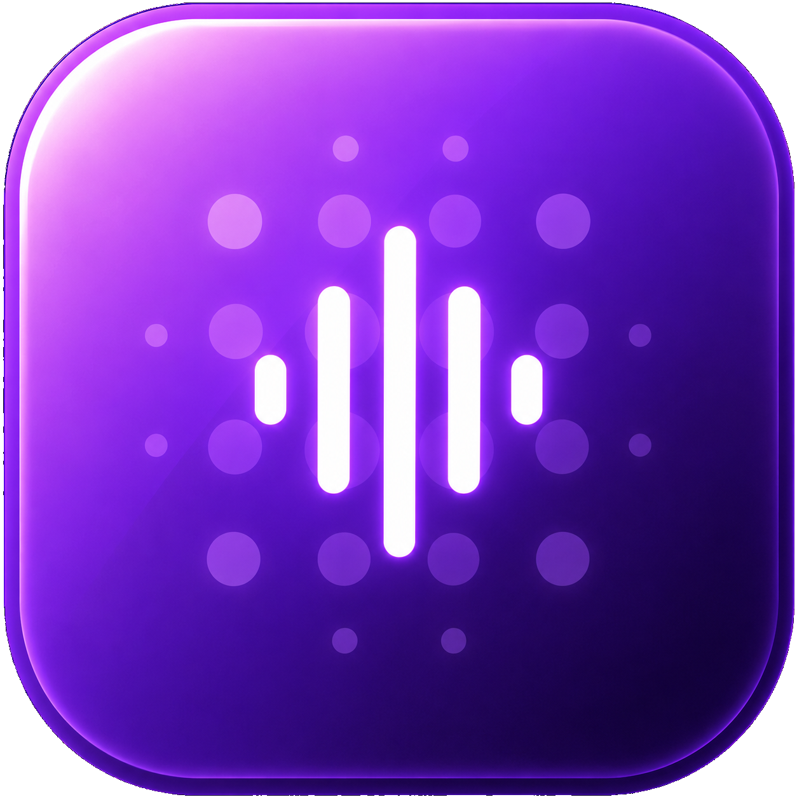
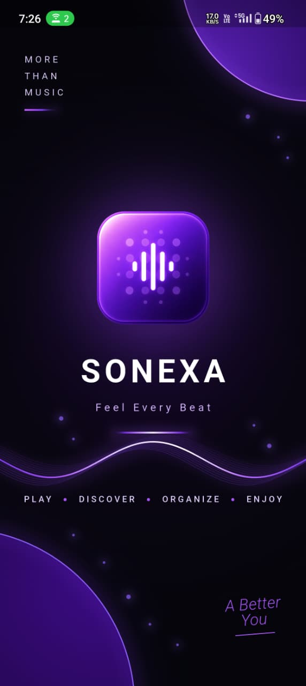
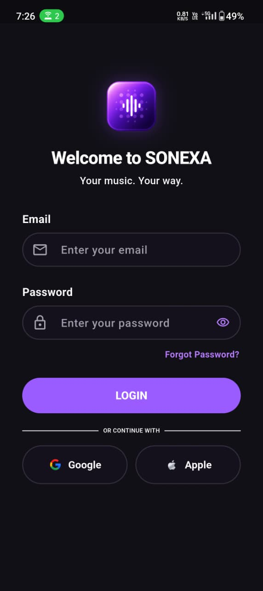
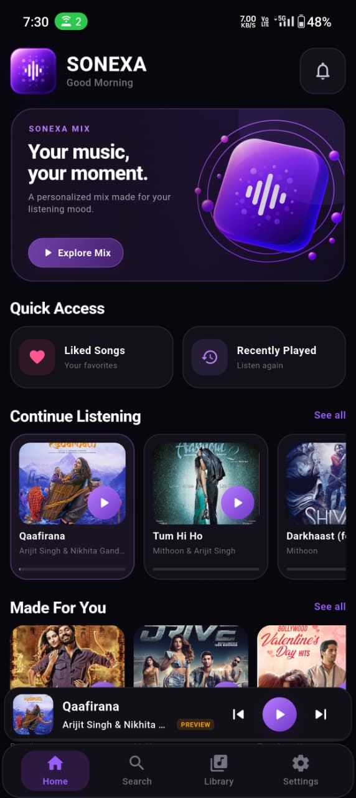
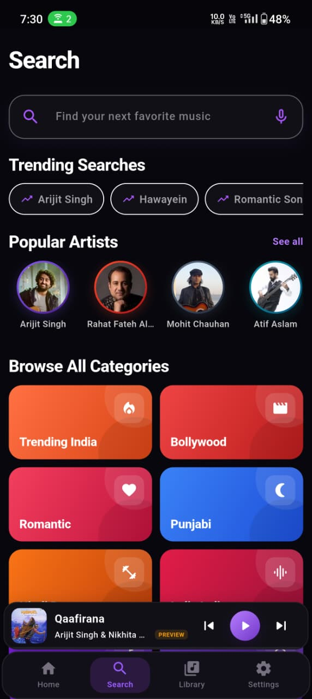
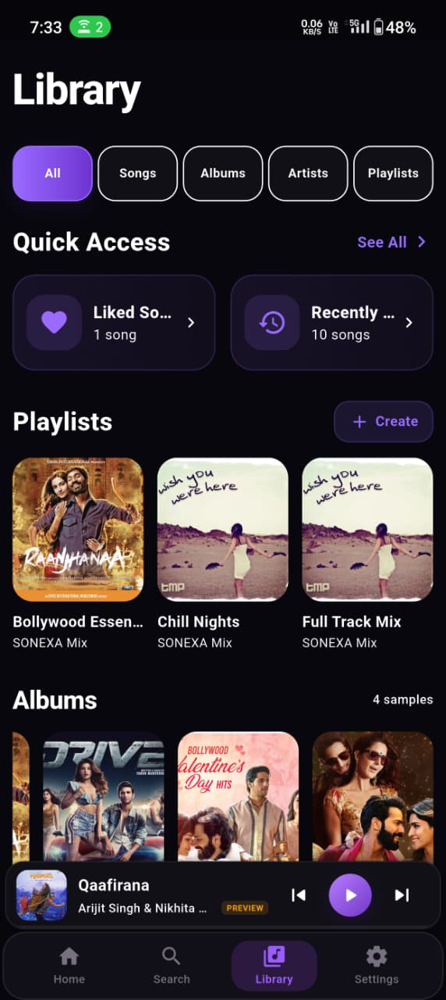
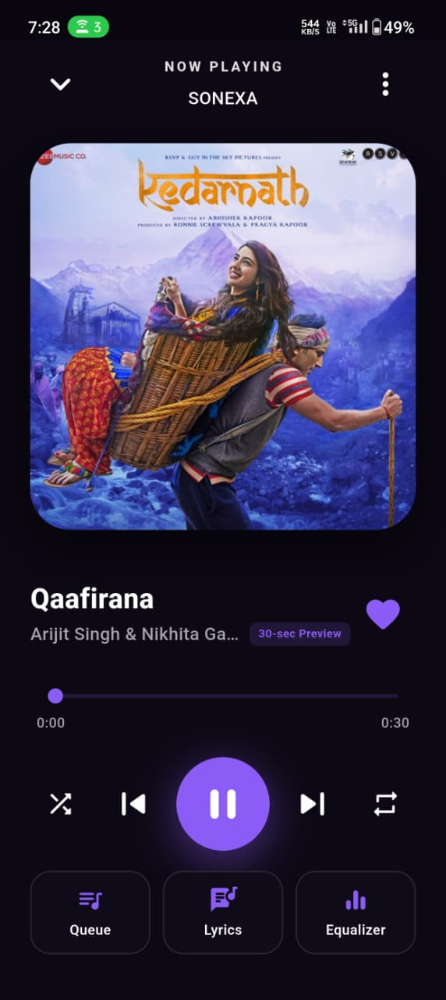
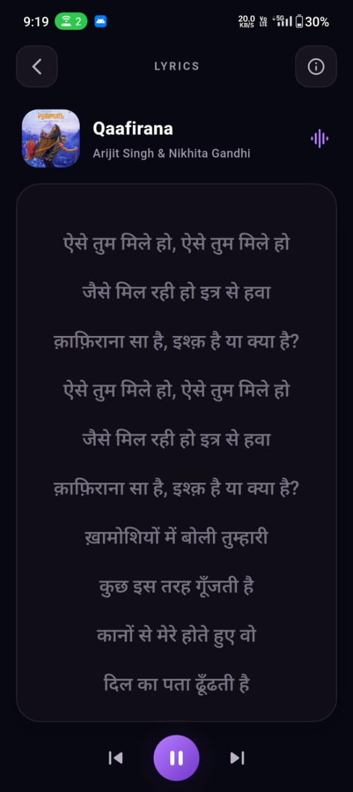
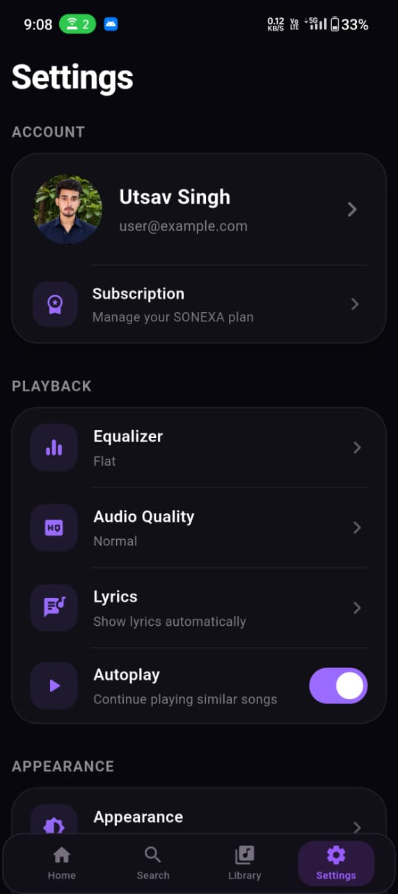

<div align="center">



# SONEXA

### Feel Every Beat

A modern Flutter music player with online music discovery, persistent collections, lyrics, queue controls, and a polished dark interface.

[](https://flutter.dev/)
[](https://dart.dev/)


</div>

---

## About

SONEXA is a portfolio-level Android music player built with Flutter and Dart. It combines local playback with online catalogue discovery through multiple music APIs and provides a complete listening flow across Home, Search, Library, Playback, Queue, Lyrics, and Settings.

The project demonstrates responsive Flutter UI development, audio playback, REST API integration, persistent local state, reusable widgets, collection-based navigation, and release build preparation.

## App Preview

<p align="center">
  
  
  
  
</p>

<p align="center">
  <sub>Splash&nbsp;&nbsp;&nbsp;&nbsp;&nbsp;&nbsp;&nbsp;&nbsp;&nbsp;&nbsp;&nbsp;&nbsp;&nbsp;&nbsp;&nbsp;&nbsp;&nbsp;&nbsp;&nbsp;&nbsp;&nbsp;&nbsp; Login&nbsp;&nbsp;&nbsp;&nbsp;&nbsp;&nbsp;&nbsp;&nbsp;&nbsp;&nbsp;&nbsp;&nbsp;&nbsp;&nbsp;&nbsp;&nbsp;&nbsp;&nbsp;&nbsp;&nbsp;&nbsp;&nbsp; Home&nbsp;&nbsp;&nbsp;&nbsp;&nbsp;&nbsp;&nbsp;&nbsp;&nbsp;&nbsp;&nbsp;&nbsp;&nbsp;&nbsp;&nbsp;&nbsp;&nbsp;&nbsp;&nbsp;&nbsp;&nbsp;&nbsp; Search</sub>
</p>

<p align="center">
  
  
  
  
</p>

<p align="center">
  <sub>Library&nbsp;&nbsp;&nbsp;&nbsp;&nbsp;&nbsp;&nbsp;&nbsp;&nbsp;&nbsp;&nbsp;&nbsp;&nbsp;&nbsp;&nbsp;&nbsp;&nbsp;&nbsp;&nbsp;&nbsp; Playback&nbsp;&nbsp;&nbsp;&nbsp;&nbsp;&nbsp;&nbsp;&nbsp;&nbsp;&nbsp;&nbsp;&nbsp;&nbsp;&nbsp;&nbsp;&nbsp;&nbsp; Lyrics&nbsp;&nbsp;&nbsp;&nbsp;&nbsp;&nbsp;&nbsp;&nbsp;&nbsp;&nbsp;&nbsp;&nbsp;&nbsp;&nbsp;&nbsp;&nbsp;&nbsp;&nbsp;&nbsp;&nbsp; Settings</sub>
</p>

---

## Key Features

### Music discovery

- Dynamic song catalogues from iTunes, Jamendo, and Audius
- Search by song, artist, album, and category
- Curated Home sections including Quick Access, Continue Listening, Made For You, and Trending
- Network artwork loading with graceful fallbacks
- Preview and full-track source indicators

### Playback experience

- Play, pause, next, previous, seek, shuffle, and repeat controls
- Full Playback screen with artwork and track information
- Persistent global mini player
- Collection-aware playback from albums, artists, playlists, and queue
- Queue management with immediate track switching
- Equalizer interface with persisted preferences

### Personal library

- Liked Songs and Recently Played
- User-created playlists with add/remove song controls
- Saved albums and artists
- Songs, Albums, Artists, and Playlists filters
- Album and artist collections with grouped tracks
- Persistent library data across app restarts

### Lyrics and appearance

- Online lyrics lookup through LRCLIB
- Local lyrics fallback support
- Dark, Light, and System theme modes
- Persistent settings
- Responsive layouts with fixed navigation and mini-player positioning

## APIs and Services

| Service | Purpose |
|---|---|
| iTunes Search API | Music discovery, metadata, artwork, and previews |
| Jamendo API | Full-track catalogue integration |
| Audius API | Additional online music discovery |
| LRCLIB | Online lyrics lookup |
| SharedPreferences | Local persistence for library and settings |

## Tech Stack

| Technology | Usage |
|---|---|
| Flutter | Android application UI and architecture |
| Dart | Application logic |
| just_audio | Local and network audio playback |
| audio_service | Audio service foundation |
| http | REST API requests |
| SharedPreferences | Persistent local state |
| Material Design | Components, navigation, and theming |

## Project Structure

```text
SONEXA/
├── android/
├── assets/
│   └── images/
├── lib/
│   ├── data/
│   ├── models/
│   ├── navigation/
│   ├── player/
│   ├── screens/
│   ├── services/
│   ├── theme/
│   ├── widgets/
│   └── main.dart
├── screenshots/
├── pubspec.yaml
└── README.md
```

## Getting Started

### Prerequisites

- Flutter SDK 3.47.1 or compatible
- Dart SDK 3.13.1 or compatible
- Android SDK
- Android Studio or Visual Studio Code
- Android device or emulator

Verify your environment:

```bash
flutter doctor
```

### Installation

```bash
git clone https://github.com/utsavsingh1920/SONEXA.git
cd SONEXA
flutter pub get
flutter run
```

### Local audio setup

Copyrighted demo audio is intentionally excluded from this public repository. To run the bundled local catalogue, add your own legally licensed audio files under `assets/audio/` and update the paths in `pubspec.yaml` and `lib/data/songs_data.dart`.

Online catalogue features require an internet connection. API availability and preview/full-track access depend on the respective providers.

## Release Status

- Version: **1.0.0**
- Android ARM64 release build tested on a physical device
- Flutter analysis completed without issues
- Core navigation, playback, APIs, persistence, queue, and lyrics verified
- Public APK distribution is withheld because demonstration media is not included in the repository

## Roadmap

- Replace local demonstration tracks with royalty-free audio
- Improve background and lock-screen playback
- Add headset and Bluetooth media controls
- Introduce automated widget and integration tests
- Improve caching and offline catalogue support

## Developer

**Utsav Singh**  
B.Sc. Information Technology Graduate  
Flutter and Full-Stack Development Enthusiast

- GitHub: [@utsavsingh1920](https://github.com/utsavsingh1920)

## Disclaimer

SONEXA is an educational and portfolio project. Music, artist names, album artwork, trademarks, and other third-party media remain the property of their respective owners. SONEXA is not affiliated with or endorsed by any music streaming service, record label, or API provider.

---

<div align="center">

**Made with Flutter and 💜 by Utsav Singh**

© 2026 Utsav Singh

</div>
